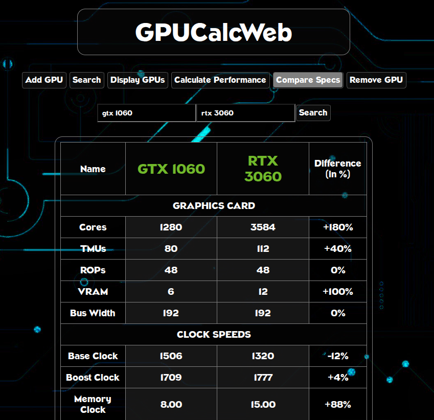

# GPUCalcWeb

## About

Calculate the Theoretical Performance of your favorite graphics cards, compare their specifications and performance, and add all of your favorite ones to app's GPU list.

- Built using Node.js, HTML, CSS and JavaScript.

- [Live demo⇗](https://gpucalcweb.onrender.com) available on Render.

### Screenshots





## Requirements

- Node.js v18 or later


## Usage

Install dependencies and run the app
```bash
npm install && npm run start
```

Access the Web UI on `http://localhost:3000`
